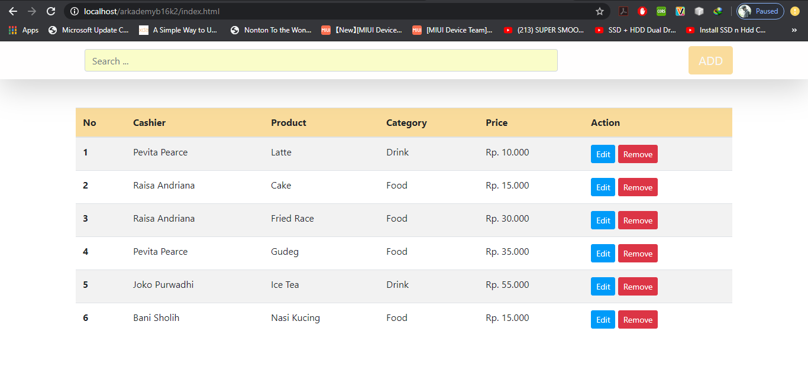
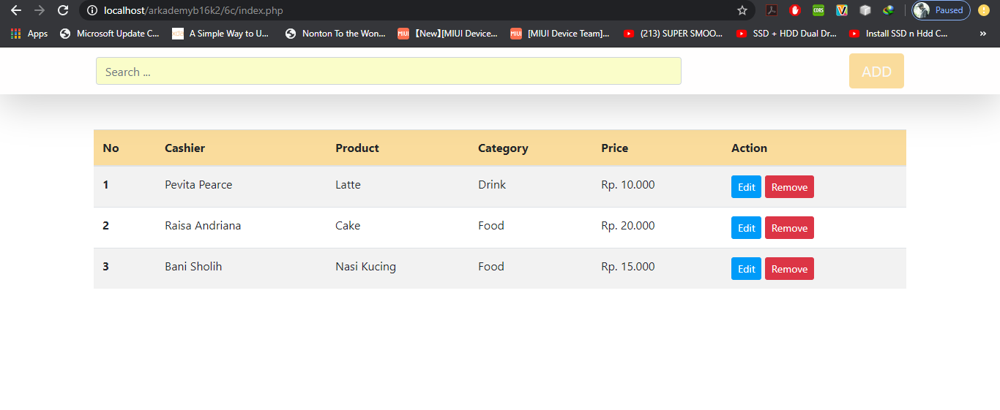

# ArkademyB16K3-BaniSholih
# Bismillah

#JSON (JavaScript Object Notation) adalah sebuah format data yang digunakan untuk pertukaran dan penyimpanan data yang berfungsi sebagai pertukaran data antar aplikasi. Saya menggunakan bahasa pemrograman javascript.
Semua Soal dapat dijalankan di console. Untuk soal no 6 file sql ada di folder 6c. Terimakasih :)

# SCREENSHOOT No 6

# 6a

# 6b

.png)
.png)

# 6c

.png)
.png)
